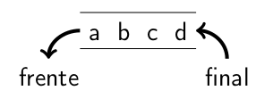

# Cola

Una **`cola`** es una secuencia de elementos en la que las operaciones se realizan por los extremos:
- Las eliminaciones se realizan por el extremo llamado inicio, frente o principio de la cola.
- Los nuevos elementos son añadidos por el otro extremo, llamado fondo o final de la cola.

En una cola el primer elemento añadido es el primero en salir de ella, por lo que también se les conoce como estructuras
**FIFO: First Input First Output.**

<h3 align="center"></h3>

## Operaciones

**`cola()`**
- **Postcondiciones:** Crea una cola vacía.

**`bool vacia() const`**
- **Postcondiciones:** Devuelve true si la cola está vacía.

**`const tElemento& frente() const`**
- **Precondiciones:** La cola no está vacía.
- **Postcondiciones:** Devuelve el elemento del inicio de la cola.

**`void pop()`**
- **Precondiciones:** La cola no está vacía.
- **Postcondiciones:** Elimina el elemento del inicio de la cola y el siguiente se convierte en el nuevo inicio.

**`void push(const tElemento& x)`**
- **Postcondiciones:** Inserta el elemento x al final de la cola.

## Implementaciones

### Vectorial

```c++
#ifndef COLA_VEC_H
#define COLA_VEC_H
#include <cassert>

template <typename T> 
class Cola {
    public:
        explicit Cola(size_t TamaMax); // constructor, requiere ctor. T()
        Cola(const Cola<T>& C); // ctor. de copia, requiere ctor. T()
        Cola<T>& operator =(const Cola<T>& C); // asig. colas, req. T()
        bool vacia() const;
        bool llena() const; // Requerida por la implementación
        const T& frente() const;
        void pop();
        void push(const T& x);
        ~Cola(); // destructor
    private:
        T *elementos; // vector de elementos
        int Lmax; // tamaño del vector
        int fin; // posición del último
};

template <typename T>
inline Cola<T>::Cola(size_t TamaMax) : elementos(new T[TamaMax]),
                                       Lmax(TamaMax),
                                       fin(-1){}

template <typename T>
Cola<T>::Cola(const Cola<T>& C) : elementos(new T[C.Lmax]),
                                  Lmax(C.Lmax),
                                  fin(C.fin){
    for (int i = 0; i <= fin; i++) // copiar el vector
        elementos[i] = C.elementos[i];
}

template <typename T>
Cola<T>& Cola<T>::operator =(const Cola<T>& C){
    if (this != &C) { // evitar autoasignación
        // Destruir el vector y crear uno nuevo si es necesario
        if (Lmax != C.Lmax) {
            delete[] elementos;
            Lmax = C.Lmax;
            elementos = new T[Lmax];
        }
        // Copiar el vector
        fin = C.fin;
        for (int i = 0; i <= fin; i++)
            elementos[i] = C.elementos[i];
    }
    return *this;
}

template <typename T>
inline bool Cola<T>::vacia() const{
    return (fin == -1);
}

template <typename T>
inline bool Cola<T>::llena() const{
    return (fin == Lmax - 1);
}

template <typename T>
inline const T& Cola<T>::frente() const{
    assert(!vacia());
    return elementos[0];
}

template <typename T>
void Cola<T>::pop(){
    assert(!vacia());
    for (int i = 0; i < fin; i++)
        elementos[i] = elementos[i+1];
    fin--;
}

template <typename T>
inline void Cola<T>::push(const T& x){
    assert(!llena());
    fin++;
    elementos[fin] = x;
}

template <typename T>
inline Cola<T>::~Cola(){
    delete[] elementos;
}

#endif // COLA_VEC_H
```