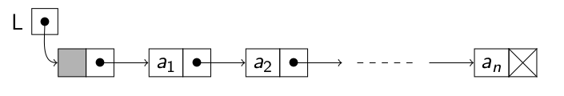
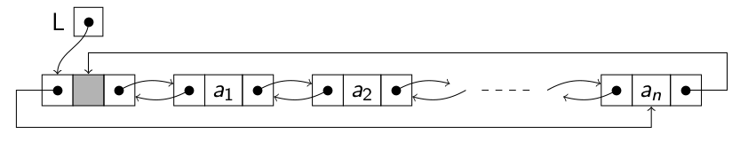

# Lista

Una lista es una secuencia de elementos de un tipo determinado L = (a1, a2, ..., an) cuya longitud es n > 0. Si n = 0, entonces es una lista vacía.

- **Posicion:** Lugar que ocupa un elemento en la lista. Los elementos están ordenados de forma lineal según las posiciones que ocupan. Todos los elementos, salvo el primero, tienen un único predecesor y todos,excepto el último, tienen un único sucesor.

- **Posicion fin():** Posición especial que sigue a la del último elemento y que nunca está ocupada por elemento alguno.

## Operaciones

**`Lista()`**
- **Postcondiciones:** Crea y devuelve una lista vacía.

**`void insertar(const T& x, posicion p)`**
- **Precondiciones:** L=(a1, a2, ..., an) 1 <= p <= n+1
- **Postcondiciones:** L=(a1, ..., ap−1, x, ap, ..., an)

**`void eliminar(posicion p)`**
- **Precondiciones:** L=(a1, a2, ..., an) 1 <= p <= n
- **Postcondiciones:** L=(a1, ..., ap−1, ap+1, ..., an)

**`const T& elemento(posicion p) const`**  
**`T& elemento(posicion p)`**
- **Precondiciones:** L=(a1, a2, ..., an) 1 <= p <= n
- **Postcondiciones:** Devuelve ap , el elemento que ocupa la posición p de la lista L.

**`posicion buscar(const T& x) const`**
- **Postcondiciones:** Devuelve la posición de la primera ocurrencia de x en la lista. Si x no se encuentra, devuelve la posición fin().

**`posicion siguiente(posicion p) const`**
- **Precondiciones:** L=(a1, a2, ..., an) 1 <= p <= n
- **Postcondiciones:** Devuelve la posición que sigue ap.

**`posicion anterior(posicion p) const`**
- **Precondiciones:** L=(a1, a2, ..., an) 2 <= p <= n+1
- **Postcondiciones:** Devuelve la posición que precede ap.

**`posicion primera() const`**
- **Postcondiciones:** Devuelve la primera posición de la lista. Si la lista está vacía, devuelve la posición fin().

**`posicion fin() const`**
- **Postcondiciones:** Devuelve la última posición de la lista, la siguiente a la del último elemento. Esta posición siempre está vacía, no existe ningún elemento que la ocupe.

## Implementaciones

### Vectorial

```c++
#ifndef LISTA_VEC_H
#define LISTA_VEC_H
#include <cassert>

template <typename T>
class Lista {
    public:
        typedef int posicion; // posición de un elto
        explicit Lista(size_t TamaMax); // constructor
        Lista(const Lista<T>& l); // ctor. de copia
        Lista<T>& operator =(const Lista<T>& l); // asignación entre listas
        void insertar(const T& x, posicion p);
        void eliminar(posicion p);
        const T& elemento(posicion p) const; // acceso a elto, lectura
        T& elemento(posicion p); // acceso a elto, lectura/escritura
        posicion buscar(const T& x) const; // requiere operador == para el tipo T
        posicion siguiente(posicion p) const;
        posicion anterior(posicion p) const;
        posicion primera() const;
        posicion fin() const; // posición después del último
        ~Lista(); // destructor
    private:
        T *elementos; // vector de elementos
        int Lmax; // tamaño del vector
        int n; // longitud de la lista
};

template <typename T>
inline Lista<T>::Lista(size_t TamaMax) : elementos(new T[TamaMax]),
                                         Lmax(TamaMax),
                                         n(0){}

template <typename T>
Lista<T>::Lista(const Lista<T>& l) : elementos(new T[l.Lmax]),
                                     Lmax(l.Lmax),
                                     n(l.n){
    for (Lista<T>::posicion p = 0; p < n; p++) // copiar el vector
        elementos[p] = l.elementos[p];
}

template <typename T>
Lista<T>& Lista<T>::operator =(const Lista<T>& l){
    if (this != &l) { // evitar autoasignación
        // Destruir el vector y crear uno nuevo si es necesario
        if (Lmax != l.Lmax) {
            delete[] elementos;
            Lmax = l.Lmax;
            elementos = new T[Lmax];
        }
        // Copiar el vector
        n = l.n;
        for (Lista<T>::posicion p = 0; p < n; p++)
            elementos[p] = l.elementos[p];
    }
    return *this;
}

template <typename T>
void Lista<T>::insertar(const T& x, Lista<T>::posicion p){
    assert(p >= 0 && p <= n); // posición válida
    assert(n < Lmax); // lista no llena
    for (Lista<T>::posicion q = n; q > p; q--)
        // desplazar los eltos. en p, p+1, ...
        elementos[q] = elementos[q-1]; // a la siguiente posición
    elementos[p] = x;
    n++;
}

template <typename T>
void Lista<T>::eliminar(Lista<T>::posicion p){
    assert(p >= 0 && p < n); // posición válida
    n--;
    for (Lista<T>::posicion q = p; q < n; q++)
        //desplazar los eltos. en p+1, p+2, ...
        elementos[q] = elementos[q+1]; // a la posición anterior
}

template <typename T> inline
const T& Lista<T>::elemento(Lista<T>::posicion p) const{
    assert(p >= 0 && p < n); // posición válida
    return elementos[p];
}

template <typename T>
inline T& Lista<T>::elemento(Lista<T>::posicion p){
    assert(p >= 0 && p < n); // posición válida
    return elementos[p];
}

template <typename T>
typename Lista<T>::posicion Lista<T>::buscar(const T& x)
const{
    Lista<T>::posicion q = 0;
    bool encontrado = false;
    while (q < n && !encontrado)
        if (elementos[q] == x)
            encontrado = true;
        else q++;
    return q;
}

template <typename T>
inline typename Lista<T>::posicion Lista<T>::siguiente(Lista<
T>::posicion p) const{
    assert(p >= 0 && p < n); // posición válida
    return p+1;
}

template <typename T>
inline typename Lista<T>::posicion Lista<T>::anterior(Lista<T
>::posicion p) const{
    assert(p > 0 && p <= n); // posición válida
    return p-1;
}

template <typename T>
inline typename Lista<T>::posicion Lista<T>::primera() const{ 
    return 0; 
}

template <typename T>
inline typename Lista<T>::posicion Lista<T>::fin() const{ 
    return n; 
}

template <typename T>
inline Lista<T>::~Lista(){ 
    delete[] elementos; 
}

#endif // LISTA_VEC_H
```

### Enlazada con cabecera

<h3 align="center"></h3>

```c++
#ifndef LISTA_ENLA_H
#define LISTA_ENLA_H
#include <cassert>

template <typename T> 
class Lista {
    struct nodo; // declaración adelantada privada
    public:
        typedef nodo* posicion; // posición de un elemento
        Lista(); // constructor, requiere ctor. T()
        Lista(const Lista<T>& l); // ctor. de copia, requiere ctor. T()
        Lista<T>& operator =(const Lista<T>& l); // asignación de listas
        void insertar(const T& x, posicion p);
        void eliminar(posicion p);
        const T& elemento(posicion p) const; // acceso a elto, lectura
        T& elemento(posicion p); // acceso a elto, lectura/escritura
        posicion buscar(const T& x) const; // T requiere operador ==
        posicion siguiente(posicion p) const;
        posicion anterior(posicion p) const;
        posicion primera() const;
        posicion fin() const; // posición después del último
        ~Lista(); // destructor
    private:
        struct nodo {
            T elto;
            nodo* sig;
            nodo(const T& e, nodo* p = 0): elto(e), sig(p) {}
        };
        nodo* L; // lista enlazada de nodos
        void copiar(const Lista<T>& l);
};

// Método privado
template <typename T>
void Lista<T>::copiar(const Lista<T> &l){
    L = new nodo(T()); // crear el nodo cabecera    
    nodo* q = L;
    for (nodo* r = l.L->sig; r; r = r->sig) {
        q->sig = new nodo(r->elto);
        q = q->sig;
    }
}

template <typename T>
inline Lista<T>::Lista() : L(new nodo(T())) // crear cabecera
{}

template <typename T>
inline Lista<T>::Lista(const Lista<T>& l){
    copiar(l);
}

template <typename T>
Lista<T>& Lista<T>::operator =(const Lista<T>& l){
    if (this != &l) { // evitar autoasignación
        this->~Lista(); // vaciar la lista actual
        copiar(l);
    }
    return *this;
}

template <typename T> inline
void Lista<T>::insertar(const T& x, Lista<T>::posicion p){
    p->sig = new nodo(x, p->sig);
    // el nuevo nodo con x queda en la posición p
}

template <typename T>
inline void Lista<T>::eliminar(Lista<T>::posicion p){
    assert(p->sig); // p no es fin
    nodo* q = p->sig;
    p->sig = q->sig;
    delete q;
    // el nodo siguiente queda en la posición p
}

template <typename T> inline
const T& Lista<T>::elemento(Lista<T>::posicion p) const{
    assert(p->sig); // p no es fin
    return p->sig->elto;
}

template <typename T>
inline T& Lista<T>::elemento(Lista<T>::posicion p){
    assert(p->sig); // p no es fin
    return p->sig->elto;
}

template <typename T>
typename Lista<T>::posicion Lista<T>::buscar(const T& x) const{
    nodo* q = L;
    bool encontrado = false;
    while (q->sig && !encontrado)
        if (q->sig->elto == x)
            encontrado = true;
        else q = q->sig;
    return q;
}
template <typename T> inline
typename Lista<T>::posicion Lista<T>::siguiente(Lista<T>::posicion p) const{
    assert(p->sig); // p no es fin
    return p->sig;
}

template <typename T>
typename Lista<T>::posicion Lista<T>::anterior(Lista<T>::posicion p) const{
    nodo* q;
    assert(p != L); // p no es la primera posición
    for (q = L; q->sig != p; q = q->sig);
    return q;
}

template <typename T>
inline typename Lista<T>::posicion Lista<T>::primera() const{
    return L;
}

template <typename T>
typename Lista<T>::posicion Lista<T>::fin() const{
    nodo* p;
    for (p = L; p->sig; p = p->sig);
    return p;
}

// Destructor: destruye el nodo cabecera y vacía la lista
template <typename T> Lista<T>::~Lista(){
    nodo* q;
    while (L) {
        q = L->sig;
        delete L;
        L = q;
    }
}

#endif // LISTA_ENLA_H
```

### Doblemente enlazada con cabecera

<h3></h3>


```c++
#ifndef LISTA_DOBLE_H
#define LISTA_DOBLE_H
#include <cassert>
template <typename T> 
class Lista {
    struct nodo; // declaración adelantada privada
    public:
        typedef nodo* posicion; // posición de un elemento
        Lista(); // constructor, requiere ctor. T()
        Lista(const Lista<T>& l); // ctor. de copia, requiere ctor. T()
        Lista<T>& operator =(const Lista<T>& l); // asignación entre listas
        void insertar(const T& x, posicion p);
        void eliminar(posicion p);
        const T& elemento(posicion p) const; // acceso a elto, lectura
        T& elemento(posicion p); // acceso a elto, lectura/escritura
        posicion buscar(const T& x) const; // T requiere operador ==
        posicion siguiente(posicion p) const;
        posicion anterior(posicion p) const;
        posicion primera() const;
        posicion fin() const; // posición después del último
        ~Lista(); // destructor
    private:
        struct nodo {
            T elto;
            nodo *ant, *sig;
            nodo(const T& e, nodo* a = 0, nodo* s = 0) : elto(e), ant(a), sig(s) {}
        };
        nodo* L; // lista doblemente enlazada de nodos
        void copiar(const Lista<T>& l);
};

// Método privado
template <typename T>
void Lista<T>::copiar(const Lista<T> &l){
    L = new nodo(T()); // crear el nodo cabecera
    L->ant = L->sig = L; // estructura circular
    // Copiar elementos de l
    for (nodo* q = l.L->sig; q != l.L; q = q->sig)
        L->ant = L->ant->sig = new nodo(q->elto, L->ant, L);
}

template <typename T>
inline Lista<T>::Lista() : L(new nodo(T())) // crear cabecera
{
    L->ant = L->sig = L; // estructura circular
}

template <typename T>
inline Lista<T>::Lista(const Lista<T>& l){ 
    copiar(l); 
}

template <typename T>
Lista<T>& Lista<T>::operator =(const Lista<T>& l){
    if (this != &l) { // evitar autoasignación
        this->~Lista(); // vaciar la lista actual
        copiar(l);
    }
    return *this;
}

template <typename T> inline
void Lista<T>::insertar(const T& x, Lista<T>::posicion p){
    p->sig = p->sig->ant = new nodo(x, p, p->sig);
    // el nuevo nodo con x queda en la posición p
}

template <typename T>
inline void Lista<T>::eliminar(Lista<T>::posicion p){
    assert(p->sig != L); // p no es fin
    nodo* q = p->sig;
    p->sig = q->sig;
    p->sig->ant = p;
    delete q;
    // el nodo siguiente queda en la posición p
}

template <typename T> inline
const T& Lista<T>::elemento(Lista<T>::posicion p) const{
    assert(p->sig != L); // p no es fin
    return p->sig->elto;
}

template <typename T>
inline T& Lista<T>::elemento(Lista<T>::posicion p){
    assert(p->sig != L); // p no es fin
    return p->sig->elto;
}

template <typename T>
typename Lista<T>::posicion
Lista<T>::buscar(const T& x) const{
    nodo* q = L;
    bool encontrado = false;
    while (q->sig != L && !encontrado)
        if (q->sig->elto == x)
            encontrado = true;
        else q = q->sig;
    return q;
}

template <typename T> inline
typename Lista<T>::posicion
Lista<T>::siguiente(Lista<T>::posicion p) const{
    assert(p->sig != L); // p no es fin
    return p->sig;
}

template <typename T> inline
typename Lista<T>::posicion
Lista<T>::anterior(Lista<T>::posicion p) const{
    assert(p != L); // p no es la primera posición
    return p->ant;
}

template <typename T>
inline typename Lista<T>::posicion Lista<T>::primera() const{
    return L;
}

template <typename T>
inline typename Lista<T>::posicion Lista<T>::fin() const{
    return L->ant;
}

// Destructor: Vacía la lista y destruye el nodo cabecera
template <typename T>
Lista<T>::~Lista(){
    nodo* q;
    while (L->sig != L) {
        q = L->sig;
        L->sig = q->sig;    
        delete q;
    }
    delete L;
}

#endif // LISTA_DOBLE_H
```