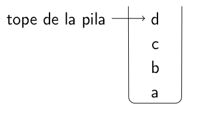
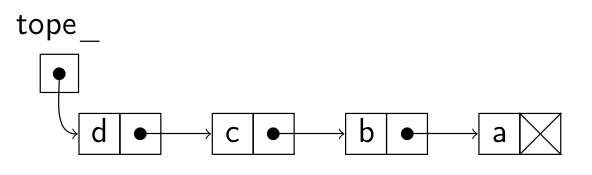

# Pila

Una **`pila`** es una secuencia de elementos en la que todas las
operaciones se realizan por un extremo de la misma.

En una pila el último elemento añadido es el primero en salir
de ella, por lo que también se les conoce como estructuras **LIFO: Last Input First Output**

<h3 align="center"></h3>

## Operaciones

**`Pila()`**
- **Postcondiciones:** Crea una pila vacía.

**`bool vacia() const`**
- **Postcondiciones:** Devuelve true si la pila está vacía.

**`const tElemento& tope() const`**
- **Precondiciones:** La pila no está vacía.
- **Postcondiciones:** Devuelve el elemento del tope de la pila.

**`void pop()`**
- **Precondiciones:** La pila no está vacía.
- **Postcondiciones:** Elimina el elemento del tope de la pila y el
siguiente se convierte en el nuevo tope.

**`void push(const tElemento& x)`**
- **Postcondiciones:** Inserta el elemento x en el tope de la pila y el
antiguo tope pasa a ser el siguiente.

## Implementaciones

### Vectorial estatica

```c++
#ifndef PILA_VEC_H
#define PILA_VEC_H
#include <cassert>

template <typename tElemento>
class Pila {
    public:
        explicit Pila(unsigned TamaMax); // ctor., requiere ctor. tElemento()
        Pila(const Pila& P); // ctor. de copia
        Pila& operator =(const Pila& P); // asignación entre pilas
        bool vacia() const;
        bool llena() const; // Requerida por la implementación
        const tElemento& tope() const;
        void pop();
        void push(const tElemento& x);
        ~Pila(); // destructor
    private:
        tElemento *elementos; // vector de elementos
        int Lmax; // tamaño del vector
        int tope_; // posición del tope
};

template <typename tElemento>
inline Pila<tElemento>::Pila(unsigned TamaMax) : elementos(new tElemento[TamaMax]),
                                                 Lmax(TamaMax),
                                                 tope_(-1){}

template <typename tElemento>
Pila<tElemento>::Pila(const Pila<tElemento>& P) : elementos(new tElemento[P.Lmax]), 
                                                  Lmax(P.Lmax), 
                                                  tope_(P.tope_){
    for (int i = 0; i <= tope_; i++) // copiar el vector
        elementos[i] = P.elementos[i];
}

template <typename tElemento>
Pila<tElemento>& Pila<tElemento>::operator =(const Pila<tElemento>& P){
    if (this != &P) { // evitar autoasignación
        // Destruir el vector y crear uno nuevo si es necesario
        if (Lmax != P.Lmax) {
            delete[] elementos;
            Lmax = P.Lmax;
            elementos = new tElemento[Lmax];
        }
        // Copiar el vector
        tope_ = P.tope_;
        for (int i = 0; i <= tope_; i++)
            elementos[i] = P.elementos[i];
    }
    return *this;
}

template <typename tElemento>
bool Pila::vacia() const{
    return (tope_ == -1);
}

template <typename tElemento>
bool Pila::llena() const{
    return (tope_ == LMAX - 1);
}

template <typename tElemento>
const Pila::tElemento& Pila::tope()const{
    assert(!vacia());
    return elementos[tope_];
}

template <typename tElemento>
void Pila::pop(){
    assert(!vacia());
    --tope_;
}

template <typename tElemento>
void Pila::push(const tElemento& x){
    assert(!llena());
    ++tope_;
    elementos[tope_] = x;
}

template <typename tElemento>
inline Pila<tElemento>::~Pila(){ 
    delete[] elementos; 
}

#endif // PILA_VEC_H
```

### Celdas enlazadas

<h3 align="center"></h3>

```c++
#ifndef PILA_ENLA_H
#define PILA_ENLA_H
#include <cassert>

template <typename T>
class Pila {
    public:
        Pila(); // constructor
        Pila(const Pila<T>& P); // ctor. de copia
        Pila<T>& operator =(const Pila<T>& P); // asignación
        bool vacia() const;
        const T& tope() const;
        void pop();
        void push(const T& x);
        ~Pila(); // destructor
    private:
        struct nodo {
            T elto;
            nodo* sig;
            nodo(const T& e, nodo* p = 0): elto(e), sig(p) {}
        };
        nodo* tope_;
        void copiar(const Pila<T>& P);
};

template <typename T>
inline Pila<T>::Pila() : tope_(0) {}

template <typename T>
Pila<T>::Pila(const Pila<T>& P) : tope_(0){
    copiar(P);
}

template <typename T>
Pila<T>& Pila<T>::operator =(const Pila<T>& P){
    if (this != &P) { // evitar autoasignación
        this->~Pila(); // vaciar la pila actual
        copiar(P);
    }
    return *this;
}

template <typename T>
inline bool Pila<T>::vacia() const{ return (!tope_); }

template <typename T>
inline const T& Pila<T>::tope() const{
    assert(!vacia());
    return tope_->elto;
}

template <typename T>
inline void Pila<T>::pop(){
    assert(!vacia());
    nodo* p = tope_;
    tope_ = p->sig;
    delete p;
}

template <typename T>
inline void Pila<T>::push(const T& x){
    tope_ = new nodo(x, tope_);
}

// Destructor: vacía la pila
template <typename T>
Pila<T>::~Pila(){
    nodo* p;
    while (tope_) {
        p = tope_->sig;
        delete tope_;
        tope_ = p;
    }
}

// Método privado
template <typename T>
void Pila<T>::copiar(const Pila<T>& P){
    if (!P.vacia()) {
        tope_ = new nodo(P.tope()); // copiar el primer elto
        // Copiar el resto de elementos hasta el fondo de la pila.
        nodo* p = tope_; // recorre la pila destino
        nodo* q = P.tope_->sig; // 2o nodo, recorre la pila origen
        while (q) {
            p->sig = new nodo(q->elto);
            p = p->sig;
            q = q->sig;
        }
    }
}

#endif // PILA_ENLA_H
```
