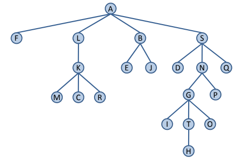
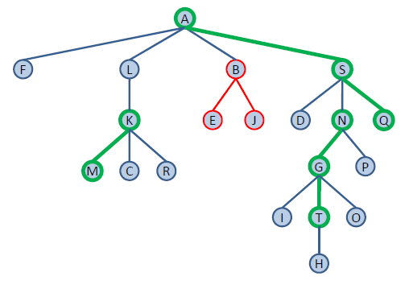
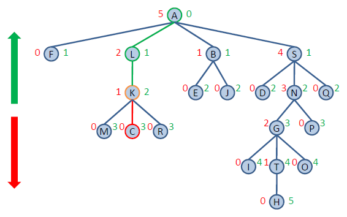
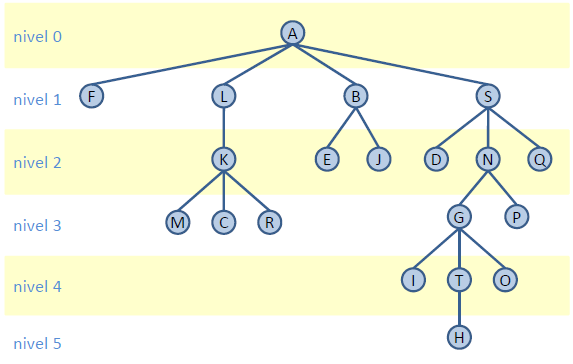

# Arbol

Un **`árbol`** es una colección de elementos de un tipo determinado, cada uno de los cuales se almacena en un **nodo**. Existe una relación de paternidad entre los nodos que determina una estructura jerárquica sobre los mismos.

<h3 align="center"></h3>

## Definiciones

- **Grado:** Número de hijos de un nodo. El grado de un árbol es el máximo de los grados de sus nodos.
<h3 align="center"></h3>

- **Camino:** Una sucesión de nodos de un árbol n1, n2, ..., nk, tal que ni es el padre de ni+1 para 1 ≤ i ≤ k. La longitud de un camino es el número de nodos menos 1. Por tanto, existe un camino de longitud 0 de cualquier nodo a sí mismo.
<h3 align="center"></h3>

- **Raíz:** Único nodo de un árbol que no tiene antecesores propios.
- **Hoja:** Nodo que no tiene descendientes propios.
- **Subárbol:** Conjunto de nodos formado por un nodo y todos sus descendientes.
- **Rama:** Camino que termina en un nodo hoja.

- **Altura:** La altura de un nodo es la longitud de la rama más larga que parte de dicho nodo. La altura de un árbol es  la altura del nodo raíz. (rojo).

- **Profundidad:** La profundidad de un nodo es la longitud del único camino desde la raíz a ese nodo. (verde).
<h3 align="center"></h3>

- **Nivel:** El nivel de un nodo coincide con su profundidad. Los nodos de un árbol de altura h se clasifican en h + 1 niveles numerados de 0 a h, de tal forma que el nivel i lo forman todos los nodos de profundidad i.
<h3 align="center"></h3>

