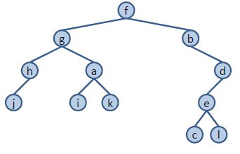
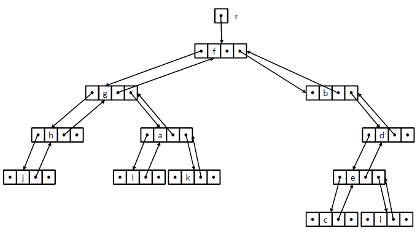
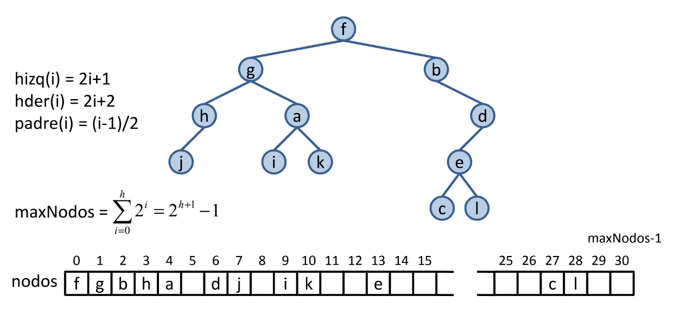
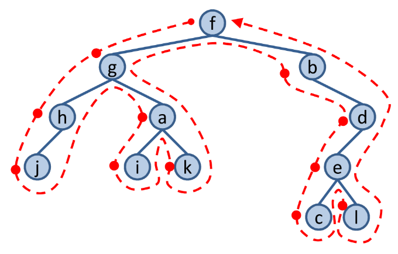
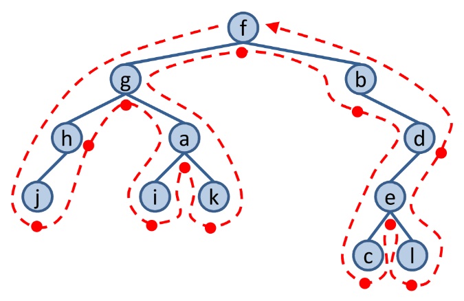
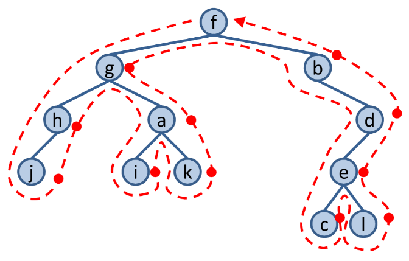

# INDICE

- [Operaciones](#id1)
- Implementacion
    - [Vectorial](#id2)
    - [Celdas Enlazadas](#id3)
    - [Posiciones Relativas](#id4)
- Recorridos
    - [Anchura](#id5)
    - Profundidad
        - [Preorden](#id6)
        - [Inorden](#id7)
        - [Postorden](#id8)

# Arbol Binario

Un **`árbol binario`** se define como un árbol cuyos nodos son, a lo sumo, de grado 2, es decir, tienen 0, 1 ó 2 hijos. Éstos se llaman hijo izquierdo e hijo derecho.

<h3 align="center"></h3>

<div id='id1' />

## Operaciones

**`Abin ()`**
- **Post:** Crea y devuelve un árbol vacío.

**`void insertarRaizB (const T& e)`**
- **Pre:** El árbol está vacío.
- **Post:** Inserta el nodo raíz cuyo contenido será e.

**`void insertarHijoIzqdoB (nodo n, const T& e)`**
- **Pre:** n es un nodo del árbol que no tiene hijo izquierdo.
- **Post:** Inserta el elemento e como hijo izquierdo del nodo n.

**`void insertarHijoDrchoB (nodo n, const T& e)`**
- **Pre:** n es un nodo del árbol que no tiene hijo derecho.
- **Post:** Inserta el elemento e como hijo derecho del nodo n.

**`void eliminarHijoIzqdoB (nodo n)`**
- **Pre:** n es un nodo del árbol. Existe hijoIzqdoB(n) y es una hoja.
- **Post:** Destruye el hijo izquierdo del nodo n.

**`void eliminarHijoDrchoB (nodo n)`**
- **Pre:** n es un nodo del árbol. Existe hijoDrchoB(n) y es una hoja.
- **Post:** Destruye el hijo derecho del nodo n.

**`void eliminarRaizB ()`**
- **Pre:** El árbol no está vacío y raizB() es una hoja.
- **Post:** Destruye el nodo raíz. El árbol queda vacío

**`bool arbolVacioB () const`**
- **Post:** Devuelve true si el árbol está vacío y false en caso contrario.

**`const T& elemento(nodo n) const`**  
**`T& elemento(nodo n)`**
- **Pre:** n es un nodo del árbol.
- **Post:** Devuelve el elemento del nodo n.

**`nodo raízB () const`**
- **Post:** Devuelve el nodo raíz del árbol. Si el árbol está vacío, devuelve NODO_NULO.

**`nodo padreB (nodo n) const`**
- **Pre:** n es un nodo del árbol.
- **Post:** Devuelve el padre del nodo n. Si n es el nodo raíz, devuelve NODO_NULO.

**`nodo hijoIzqdoB (nodo n) const`**
- **Pre:** n es un nodo del árbol.
- **Post:** Devuelve el nodo hijo izquierdo del nodo n. Si no existe, devuelve NODO_NULO.

**`nodo hijoDrchoB (nodo n) const`**
- **Pre:** n es un nodo de A.
- **Post:** Devuelve el nodo hijo derecho del nodo n. Si no existe, devuelve NODO_NULO.


## Implementacion

<div id='id2' />

### Vectorial

```c++
#ifndef ABIN_VEC0_H
#define ABIN_VEC0_H
#include <cassert>

template <typename T> 
class Abin {
    public:
        typedef int nodo; //índice de la matriz
                          // entre 0 y maxNodos-1
        static const nodo NODO_NULO;
        explicit Abin(size_t maxNodos); // constructor
        void insertarRaizB(const T& e);
        void insertarHijoIzqdoB(nodo n, const T& e);
        void insertarHijoDrchoB(nodo n, const T& e);
        void eliminarHijoIzqdoB(nodo n);
        void eliminarHijoDrchoB(nodo n);
        void eliminarRaizB();
        ~Abin(); // destructor
        bool arbolVacioB() const;
        const T& elemento(nodo n) const; // acceso a elto, lectura
        T& elemento(nodo n); // acceso a elto, lectura/escritura
        nodo raizB() const;
        nodo padreB(nodo n) const;
        nodo hijoIzqdoB(nodo n) const;
        nodo hijoDrchoB(nodo n) const;
        Abin(const Abin<T>& a); // ctor. de copia
        Abin<T>& operator =(const Abin<T>& a); // asignación
    private:
        struct celda {
            T elto;
            nodo padre, hizq, hder;
        };
        celda *nodos; // vector de nodos
        int maxNodos; // tamaño del vector
        int numNodos; // número de nodos del árbol
};

/* Definición del nodo nulo */
template <typename T>
const typename Abin<T>::nodo Abin<T>::NODO_NULO(-1);

template <typename T>
inline Abin<T>::Abin(size_t maxNodos) : nodos(new celda[maxNodos]),
                                        maxNodos(maxNodos),
                                        numNodos(0){}
                                        
template <typename T>
void Abin<T>::insertarRaizB(const T& e){
    assert(numNodos == 0); // árbol vacío
    numNodos = 1;
    nodos[0].elto = e;
    nodos[0].padre = NODO_NULO;
    nodos[0].hizq = NODO_NULO;
    nodos[0].hder = NODO_NULO;
}

template <typename T>
void Abin<T>::insertarHijoIzqdoB(Abin<T>::nodo n, const T& e){
    assert(n >= 0 && n < numNodos); // nodo válido
    assert(nodos[n].hizq == NODO_NULO); // n no tiene hijo izqdo.
    assert(numNodos < maxNodos); // árbol no lleno
    // añadir el nuevo nodo al final de la secuencia
    nodos[n].hizq = numNodos;
    nodos[numNodos].elto = e;
    nodos[numNodos].padre = n;
    nodos[numNodos].hizq = NODO_NULO;
    nodos[numNodos].hder = NODO_NULO;
    numNodos++;
}

template <typename T>
void Abin<T>::insertarHijoDrchoB(Abin<T>::nodo n, const T& e){
    assert(n >= 0 && n < numNodos); // nodo válido
    assert(nodos[n].hder == NODO_NULO); // n no tiene hijo drcho.
    assert(numNodos < maxNodos); // árbol no lleno
    // añadir el nuevo nodo al final de la secuencia
    nodos[n].hder = numNodos;
    nodos[numNodos].elto = e;
    nodos[numNodos].padre = n;
    nodos[numNodos].hizq = NODO_NULO;
    nodos[numNodos].hder = NODO_NULO;
    numNodos++;
}

template <typename T>
void Abin<T>::eliminarHijoIzqdoB(Abin<T>::nodo n){
    nodo hizqdo ;
    assert(n >= 0 && n < numNodos); // nodo válido
    hizqdo = nodos[n].hizq;
    assert(hizqdo != NODO_NULO); // existe hijo izqdo. de n
    assert(nodos[hizqdo].hizq == NODO_NULO && nodos[hizqdo].hder == NODO_NULO); // hijo izqdo. de n es hoja
    if (hizqdo != numNodos-1){
        // Mover el último nodo a la posición del hijo izqdo.
        nodos[hizqdo] = nodos[numNodos-1];
        // Actualizar la posición del hijo (izquierdo o derecho)
        // en el padre del nodo movido
        if (nodos[nodos[hizqdo].padre].hizq == numNodos-1)
            nodos[nodos[hizqdo].padre].hizq = hizqdo;
        else
            nodos[nodos[hizqdo].padre].hder = hizqdo;
        // Si el nodo movido tiene hijos,
        // actualizar la posición del padre
        if (nodos[hizqdo].hizq != NODO_NULO)
            nodos[nodos[hizqdo].hizq].padre = hizqdo;
        if (nodos[hizqdo].hder != NODO_NULO)
            nodos[nodos[hizqdo].hder].padre = hizqdo;
    }
    nodos[n].hizq = NODO_NULO;
    numNodos--;
}

template <typename T>
void Abin<T>::eliminarHijoDrchoB(Abin<T>::nodo n){
    nodo hdrcho;
    assert(n >= 0 && n < numNodos); // nodo válido
    hdrcho = nodos[n].hder;
    assert(hdrcho != NODO_NULO); // existe hijo drcho. de n
    assert(nodos[hdrcho].hizq == NODO_NULO && // hijo drcho. de
    nodos[hdrcho].hder == NODO_NULO); // n es hoja
    if (hdrcho != numNodos-1){
        // Mover el último nodo a la posición del hijo drcho.
        nodos[hdrcho] = nodos[numNodos-1];
        // Actualizar la posición del hijo (izquierdo o derecho)
        // en el padre del nodo movido
        if (nodos[nodos[hdrcho].padre].hizq == numNodos-1)
            nodos[nodos[hdrcho].padre].hizq = hdrcho;
        else
            nodos[nodos[hdrcho].padre].hder = hdrcho;
        // Si el nodo movido tiene hijos,
        // actualizar la posición del padre
        if (nodos[hdrcho].hizq != NODO_NULO)
            nodos[nodos[hdrcho].hizq].padre = hdrcho;
        if (nodos[hdrcho].hder != NODO_NULO)
            nodos[nodos[hdrcho].hder].padre = hdrcho;
    }
    nodos[n].hder = NODO_NULO;
    numNodos--;
}

template <typename T>
inline void Abin<T>::eliminarRaizB(){
    assert(numNodos == 1);
    numNodos = 0;
}

template <typename T>
inline Abin<T>::~Abin(){
    delete[] nodos;
}

template <typename T>
inline bool Abin<T>::arbolVacioB() const{
    return (numNodos == 0);
}

template <typename T>
inline const T& Abin<T>::elemento(Abin<T>::nodo n) const{
    assert(n >= 0 && n < numNodos);
    return nodos[n].elto;
}

template <typename T>
inline T& Abin<T>::elemento(Abin<T>::nodo n){
    assert(n >= 0 && n < numNodos);
    return nodos[n].elto;
}

template <typename T>
inline typename Abin<T>::nodo Abin<T>::raizB() const{
    return (numNodos > 0) ? 0 : NODO_NULO;
}

template <typename T> inline
typename Abin<T>::nodo Abin<T>::padreB(Abin<T>::nodo n) const{
    assert(n >= 0 && n < numNodos);
    return nodos[n].padre;
}

template <typename T> inline
typename Abin<T>::nodo Abin<T>::hijoIzqdoB(Abin<T>::nodo n) const{
    assert(n >= 0 && n < numNodos);
    return nodos[n].hizq;
}

template <typename T> inline
typename Abin<T>::nodo Abin<T>::hijoDrchoB(Abin<T>::nodo n) const{
    assert(n >= 0 && n < numNodos);
    return nodos[n].hder;
}

template <typename T>
Abin<T>::Abin(const Abin<T>& a) : nodos(new celda[a.maxNodos]),
                                  maxNodos(a.maxNodos),
                                  numNodos(a.numNodos){
    // copiar el vector
    for (nodo n = 0; n <= numNodos-1; n++)
        nodos[n] = a.nodos[n];
}

template <typename T>
Abin<T>& Abin<T>::operator =(const Abin<T>& a){
    if (this != &a){ // Evitar autoasignación.
        // Destruir el vector y crear uno nuevo si es necesario
        if (maxNodos != a.maxNodos){
            delete[] nodos;
            maxNodos = a.maxNodos;
            nodos = new celda[maxNodos];
        }
        // Copiar el vector
        numNodos = a.numNodos;
        for (nodo n = 0; n <= numNodos-1; n++)
            nodos[n] = a.nodos[n];
    }
    return *this;
}

#endif // ABIN_VEC0_H
```

<div id='id3' />

### Celdas enlazadas


<h3 align="center"></h3>

```c++
#ifndef ABIN_H
#define ABIN_H
#include <cassert>

template <typename T> 
class Abin {
    struct celda; // declaración adelantada privada
    public:
        typedef celda* nodo;
        static const nodo NODO_NULO;
        Abin(); // constructor
        void insertarRaizB(const T& e);
        void insertarHijoIzqdoB(nodo n, const T& e);
        void insertarHijoDrchoB(nodo n, const T& e);
        void eliminarHijoIzqdoB(nodo n);
        void eliminarHijoDrchoB(nodo n);
        void eliminarRaizB();
        ~Abin(); // destructor
        bool arbolVacioB() const;
        const T& elemento(nodo n) const; // acceso a elto, lectura
        T& elemento(nodo n); // acceso a elto, lectura/escritura
        nodo raizB() const;
        nodo padreB(nodo n) const;
        nodo hijoIzqdoB(nodo n) const;
        nodo hijoDrchoB(nodo n) const;
        Abin(const Abin<T>& a); // ctor. de copia
        Abin<T>& operator =(const Abin<T>& a); //asignación de árboles
    private:
        struct celda {
            T elto;
            nodo padre, hizq, hder;
            celda(const T& e, nodo p = NODO_NULO): elto(e), padre(p), hizq(NODO_NULO), hder(NODO_NULO) {}
        };
        nodo r; // nodo raíz del árbol
        void destruirNodos(nodo& n);
        nodo copiar(nodo n);
};

/* Definición del nodo nulo */
template <typename T>
const typename Abin<T>::nodo Abin<T>::NODO_NULO(0);

emplate <typename T>
inline Abin<T>::Abin() : r(NODO_NULO) {}

template <typename T>
inline void Abin<T>::insertarRaizB (const T& e){
    assert(r == NODO_NULO); // árbol vacío
    r = new celda(e);
}

template <typename T>
inline void Abin<T>::insertarHijoIzqdoB(Abin<T>::nodo n, const T& e){
    assert(n != NODO_NULO);
    assert(n->hizq == NODO_NULO); // no existe hijo
    n->hizq = new celda(e, n);
}

template <typename T> 
inline void Abin<T>::insertarHijoDrchoB(Abin<T>::nodo n, const T& e){
    assert(n != NODO_NULO);
    assert(n->hder == NODO_NULO); // no existe hijo
    n->hder = new celda(e, n);
}

template <typename T>
inline void Abin<T>::eliminarHijoIzqdoB(Abin<T>::nodo n){
    assert(n != NODO_NULO);
    assert(n->hizq != NODO_NULO); // existe hijo izqdo.
    assert(n->hizq->hizq == NODO_NULO && n->hizq->hder == NODO_NULO); // hijo izqdo. es hoja
    delete(n->hizq);
    n->hizq = NODO_NULO;
}

template <typename T>
inline void Abin<T>::eliminarHijoDrchoB(Abin<T>::nodo n){
    assert(n != NODO_NULO);
    assert(n->hder != NODO_NULO); // existe hijo drcho.
    assert(n->hder->hizq == NODO_NULO && n->hder->hder == NODO_NULO); // hijo drcho. es hoja
    delete(n->hder);
    n->hder = NODO_NULO;
}

template <typename T>
inline void Abin<T>::eliminarRaizB(){
    assert(r != NODO_NULO); // árbol no vacío
    assert(r->hizq == NODO_NULO &&
    r->hder == NODO_NULO); // la raíz es hoja
    delete(r);
    r = NODO_NULO;
}

template <typename T> 
inline Abin<T>::~Abin(){
    destruirNodos(r); // vacía el árbol
}

template <typename T> inline bool Abin<T>::arbolVacioB() const{ return (r == NODO_NULO); }

template <typename T>
inline const T& Abin<T>::elemento(Abin<T>::nodo n) const{
    assert(n != NODO_NULO);
    return n->elto;
}

template <typename T>
inline T& Abin<T>::elemento(Abin<T>::nodo n){
    assert(n != NODO_NULO);
    return n->elto;
}

template <typename T>
inline typename Abin<T>::nodo Abin<T>::raizB() const{
    return r;
}

template <typename T> 
inline typename Abin<T>::nodo Abin<T>::padreB(Abin<T>::nodo n) const{
    assert(n != NODO_NULO);
    return n->padre;
}

template <typename T> 
inline typename Abin<T>::nodo Abin<T>::hijoIzqdoB(Abin<T>::nodo n) const{
    assert(n != NODO_NULO);
    return n->hizq;
}

template <typename T> 
inline typename Abin<T>::nodo Abin<T>::hijoDrchoB(Abin<T>::nodo n) const{
    assert(n != NODO_NULO);
    return n->hder;
}

template <typename T>
inline Abin<T>::Abin(const Abin<T>& a){
    r = copiar(a.r);
}

template <typename T>
Abin<T>& Abin<T>::operator =(const Abin<T>& a){
    if (this != &a) { // evitar autoasignación
        this->~Abin(); // vaciar el árbol
        r = copiar(a.r);
    }
    return *this;
}

// Métodos privados

// Destruye un nodo y todos sus descendientes
template <typename T>
void Abin<T>::destruirNodos(Abin<T>::nodo& n){
    if (n != NODO_NULO){
        destruirNodos(n->hizq);
        destruirNodos(n->hder);
        delete n;
        n = NODO_NULO;
    }
}

// Devuelve una copia de un nodo y todos sus descendientes
template <typename T>
typename Abin<T>::nodo Abin<T>::copiar(Abin<T>::nodo n){
    nodo m = NODO_NULO;
    if (n != NODO_NULO){
        m = new celda(n->elto); // copiar n
        m->hizq = copiar(n->hizq); // copiar subárbol izqdo.
        if (m->hizq != NODO_NULO)
            m->hizq->padre = m;
        m->hder = copiar(n->hder); // copiar subárbol drcho.
        if (m->hder != NODO_NULO)
            m->hder->padre = m;
    }
    return m;
}

#endif // ABIN_H
```

<div id='id4' />

### Posiciones relativas

<h3 align="center"></h3>


```c++
#ifndef ABIN_VEC1_H
#define ABIN_VEC1_H
#include <cassert>

template <typename T> 
class Abin {
    public:
        typedef int nodo; // índice del vector
                          // entre 0 y maxNodos-1
        static const nodo NODO_NULO;
        explicit Abin(size_t maxNodos, const T& e_nulo = T()); //ctor
        void insertarRaizB(const T& e);
        void insertarHijoIzqdoB(nodo n, const T& e);
        void insertarHijoDrchoB(nodo n, const T& e);
        void eliminarHijoIzqdoB(nodo n);
        void eliminarHijoDrchoB(nodo n);
        ~Abin(); // destructor
        bool arbolVacioB() const;
        void eliminarRaizB();
        const T& elemento(nodo n) const; // acceso a elto, lectura
        T& elemento(nodo n); // acceso a elto, lectura/escritura
        nodo raizB() const;
        nodo padreB(nodo n) const;
        nodo hijoIzqdoB(nodo n) const;
        nodo hijoDrchoB(nodo n) const;
        Abin(const Abin<T>& a); // ctor. de copia
        Abin<T>& operator =(const Abin<T>& a); //asignación de árboles
    private:
        T* nodos; // vector de nodos
        int maxNodos; // tamaño del vector
        T ELTO_NULO; // marca celdas vacías
};

/* Definición del nodo nulo */
template <typename T>
const typename Abin<T>::nodo Abin<T>::NODO_NULO(-1);    

template <typename T>
Abin<T>::Abin(size_t maxNodos, const T& e_nulo) : nodos(new T[maxNodos]),
                                                  maxNodos(maxNodos),
                                                  ELTO_NULO(e_nulo){
    // marcar todas las celdas libres
    for (nodo n = 0; n <= maxNodos-1; n++)
        nodos[n] = ELTO_NULO;
}

template <typename T>
inline void Abin<T>::insertarRaizB(const T& e){
    assert(nodos[0] == ELTO_NULO); // árbol vacío
    nodos[0] = e;
}

template <typename T> 
inline void Abin<T>::insertarHijoIzqdoB(Abin<T>::nodo n,const T& e){
    assert(n >= 0 && n <= maxNodos-1); // nodo válido
    assert(nodos[n] != ELTO_NULO); // nodo del árbol
    assert(2*n+1 < maxNodos); // hijo izqdo. cabe en el árbol
    assert(nodos[2*n+1] == ELTO_NULO); // n no tiene hijo izqdo.
    nodos[2*n+1] = e;
}

template <typename T> 
inline void Abin<T>::insertarHijoDrchoB(Abin<T>::nodo n,const T& e){
    assert(n >= 0 && n < maxNodos-1); // nodo válido
    assert(nodos[n] != ELTO_NULO); // nodo del árbol
    assert(2*n+2 < maxNodos); // hijo drcho. cabe en el árbol
    assert(nodos[2*n+2] == ELTO_NULO); // n no tiene hijo drcho.
    nodos[2*n+2] = e;
}

template <typename T> 
inline void Abin<T>::eliminarHijoIzqdoB(Abin<T>::nodo n){
    assert(n >= 0 && n <= maxNodos-1); // nodo válido
    assert(nodos[n] != ELTO_NULO); // nodo del árbol
    assert(2*n+1 < maxNodos); // hijo izqdo. cabe en el árbol
    assert(nodos[2*n+1] != ELTO_NULO); // n tiene hijo izqdo.
    if (4*n+4 < maxNodos) // caben los hijos del hijo izqdo. de n
        assert(nodos[4*n+3] == ELTO_NULO && nodos[4*n+4] == ELTO_NULO); // hijo izqdo. de n es hoja
    else if (4*n+3 < maxNodos) //sólo cabe h. izq. de h. izq. de n
        assert(nodos[4*n+3] == ELTO_NULO); //hijo izq. de n es hoja
    nodos[2*n+1] = ELTO_NULO;
}

template <typename T> 
inline void Abin<T>::eliminarHijoDrchoB(Abin<T>::nodo n){
    assert(n >= 0 && n <= maxNodos-1); // nodo válido
    assert(nodos[n] != ELTO_NULO); // nodo del árbol
    assert(2*n+2 < maxNodos); // hijo drcho. cabe en el árbol
    assert(nodos[2*n+2] != ELTO_NULO); // n tiene hijo drcho.
    if (4*n+6 < maxNodos) // caben los hijos del hijo drcho. de n
        assert(nodos[4*n+5] == ELTO_NULO && nodos[4*n+6] == ELTO_NULO); // hijo drcho. de n es hoja
    else if (4*n+5 < maxNodos) //sólo cabe h. izq. de h. drch de n
        assert(nodos[4*n+5] == ELTO_NULO); //hijo drch de n es hoja
    nodos[2*n+2] = ELTO_NULO;
}

template <typename T>
inline void Abin<T>::eliminarRaizB(){
    assert(nodos[0] != ELTO_NULO); // árbol no vacío
    assert(nodos[1] == ELTO_NULO &&
    nodos[2] == ELTO_NULO); // la raíz es hoja
    nodos[0] = ELTO_NULO;
}

template <typename T>
inline Abin<T>::~Abin(){
    delete[] nodos;
}

template <typename T>
inline bool Abin<T>::arbolVacioB() const{
    return (nodos[0] == ELTO_NULO);
}

template <typename T>
inline const T& Abin<T>::elemento(Abin<T>::nodo n) const{
    assert(n >= 0 && n <= maxNodos-1); // nodo válido
    assert(nodos[n] != ELTO_NULO); // nodo del árbol
    return nodos[n];
}

template <typename T>
inline T& Abin<T>::elemento(Abin<T>::nodo n){
    assert(n >= 0 && n <= maxNodos-1); // nodo válido
    assert(nodos[n] != ELTO_NULO); // nodo del árbol
    return nodos[n];
}

template <typename T>
inline typename Abin<T>::nodo Abin<T>::raizB() const{
    return (nodos[0] == ELTO_NULO) ? NODO_NULO : 0;
}

template <typename T> 
inline typename Abin<T>::nodo Abin<T>::padreB(Abin<T>::nodo n) const{
    assert(n >= 0 && n <= maxNodos-1); // nodo válido
    assert(nodos[n] != ELTO_NULO); // nodo del árbol
    return (n == 0) ? NODO_NULO : (n-1)/2;
}

template <typename T> 
inline typename Abin<T>::nodo Abin<T>::hijoIzqdoB(Abin<T>::nodo n) const{
    assert(n >= 0 && n <= maxNodos-1); // nodo válido
    assert(nodos[n] != ELTO_NULO); // nodo del árbol
    return (2*n+1 >= maxNodos || nodos[2*n+1] == ELTO_NULO) ? NODO_NULO : 2*n+1;
}

template <typename T> 
inline typename Abin<T>::nodo Abin<T>::hijoDrchoB(Abin<T>::nodo n) const{
    assert(n >= 0 && n <= maxNodos-1); // nodo válido
    assert(nodos[n] != ELTO_NULO); // nodo del árbol
    return (2*n+2 >= maxNodos || nodos[2*n+2] == ELTO_NULO) ? NODO_NULO : 2*n+2;
}

template <typename T>
Abin<T>::Abin(const Abin<T>& a) : nodos(new T[a.maxNodos]),
                                  maxNodos(a.maxNodos),
                                  ELTO_NULO(a.ELTO_NULO){
    // copiar el vector
    for (nodo n = 0; n <= maxNodos-1; n++)
        nodos[n] = a.nodos[n];
}

template <typename T>
Abin<T>& Abin<T>::operator =(const Abin<T>& a){
    if (this != &a) { // evitar autoasignación
        // Destruir el vector y crear uno nuevo si es necesario
        if (maxNodos != a.maxNodos){
            delete[] nodos;
            maxNodos = a.maxNodos;
            nodos = new T[maxNodos];
        }
        ELTO_NULO = a.ELTO_NULO;
        // Copiar el vector
        for (nodo n = 0; n <= maxNodos-1; n++)
            nodos[n] = a.nodos[n];
    }
    return *this;
}

#endif // ABIN_VEC1_H
```

## Recorridos

<div id='id5' />

### Anchura

```c++
template <typename T>
void recNivelesAbin (typename Abin<T>::nodo n, const Abin<T>& A, void (*procesar)(typename Abin<T>::nodo, const Abin<T>&)){ 
    Cola<typename Abin<T>::nodo> C; // cola de nodos de árbol binario
    if (n != Abin<T>::NODO_NULO){
        do {
            if (!C.vacia()){
                n = C.frente();
                C.pop();
            }
            procesar(n, A);
            if (A.hijoIzqdoB(n) != Abin<T>::NODO_NULO)
                C.push(A.hijoIzqdoB(n));
            if (A.hijoDrchoB(n) != Abin<T>::NODO_NULO)
                C.push(A.hijoDrchoB(n));
        } while (!C.vacia());
    }
}
```

### Altura

<div id='id6' />

#### Preorden

<h3 align="center"></h3>

```c++
template <typename T>
void preordenAbin (typename Abin<T>::nodo n, const Abin<T>& A, void (*procesar)(typename Abin<T>::nodo, const Abin<T>&)){
    if (n != Abin<T>::NODO_NULO){
        procesar(n, A);
        preordenAbin(A.hijoIzqdoB(n), A, procesar);
        preordenAbin(A.hijoDrchoB(n), A, procesar);
    }
}
```

<div id='id7' />

#### Inorden

<h3 align="center"></h3>

```c++
template <typename T>
void inordenAbin (typename Abin<T>::nodo n, const Abin<T>& A, void (*procesar)(typename Abin<T>::nodo, const Abin<T>&)){
    if (n != Abin<T>::NODO_NULO){
        inordenAbin(A.hijoIzqdoB(n), A, procesar);
        procesar(n, A);
        inordenAbin(A.hijoDrchoB(n), A, procesar);
    }
}
```

<div id='id8' />

#### Postorden

<h3 align="center"></h3>

```c++
template <typename T>
void postordenAbin (typename Abin<T>::nodo n, const Abin<T>& A, void (*procesar)(typename Abin<T>::nodo, const Abin<T>&)){
    if (n != Abin<T>::NODO_NULO){
        postordenAbin(A.hijoIzqdoB(n), A, procesar);
        postordenAbin(A.hijoDrchoB(n), A, procesar);
        procesar(n, A);
    }
}
```
