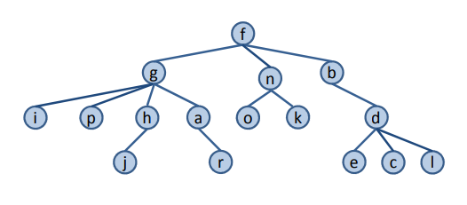

# INDICE

- [Operaciones](#id1)
- Implementaciones
  - [Vectorial](#id2)
  - [Celdas enlazadas](#id3)
- Recorridos
  - Profundidad
    - [Preorden](#id4)
    - [Inorden](#id5)
    - [Postorden](#id6)
  - [Anchura](#id7)

# Arbol general

Un **árbol general** se define como un árbol cuyos nodos son de cualquier grado, es decir, pueden tener un número cualquiera de 
hijos. Los hijos de un nodo están ordenados de izquierda a derecha, de tal forma que el primer hijo de un nodo
se llama hijo izquierdo, el segundo es el hermano derecho de éste, el tercero es el hermano derecho del segundo y así sucesivamente.

<h1 align="center"></h1>


<div id="id1"/>

## Operaciones

**`Agen()`**
  - **Post:** Construye un árbol vacío.

**`void insertarRaiz (const T& e)`**
  - **Pre:** El árbol está vacío.
  - **Post:** Inserta el nodo raíz de A cuyo contenido será e.

**`void insertarHijoIzqdo(nodo n, const T& e)`**
  - **Pre:** n es un nodo del árbol.
  - **Post:** Inserta el elemento e como hijo izquierdo del nodo n. Si ya existe hijo izquierdo, éste se convierte en el 
  hermano derecho del nuevo nodo.

**`void insertarHermDrcho(nodo n, const T& e)`**
  - **Pre:** n es un nodo del árbol y no es el nodo raíz.
  - **Post:** Inserta el elemento e como hermano derecho del nodo n del árbol. Si ya existe hermano derecho, éste se 
  convierte en el hermano derecho del nuevo nodo.

**`void eliminarHijoIzqdo(nodo n)`**
  - **Pre:** n es un nodo del árbol. Existe hijoIzqdo(n) y es una hoja.
  - **Post:** Destruye el hijo izquierdo del nodo n. El segundo hijo, si existe, se convierte en el nuevo hijo izquierdo de n.

**`void eliminarHermDrcho(nodo n)`**
  - **Pre:** n es un nodo del árbol. Existe hermDrcho(n) y es una hoja.
  - **Post:** Destruye el hermano derecho del nodo n. El siguiente hermano se convierte en el nuevo hermano derecho de n.

**`void eliminarRaiz()`**
  - **Pre:** El árbol no está vacío y raiz() es una hoja.
  - **Post:** Destruye el nodo raíz. El árbol queda vacío.

**`bool arbolVacio() const`**
  - **Post :** Devuelve true si el árbol está vacío y false en caso contrario.

**`const T& elemento(nodo n) const`**
**`T& elemento(nodo n)`**
  - **Pre:** n es un nodo del árbol.
  - **Post:** Devuelve el elemento del nodo n.

**`nodo raiz() const`**
  - **Post:** Devuelve el nodo raíz del árbol. Si el árbol está vacío, devuelve NODO_NULO.

**`nodo padre(nodo n) const`**
  - **Pre:** n es un nodo del árbol.
  - **Post:** Devuelve el padre del nodo n. Si n es el nodo raíz, devuelve NODO_NULO.

**`nodo hijoIzqdo(nodo n) const`**
  - **Pre:** n es un nodo del árbol.
  - **Post:** Devuelve el hijo izquierdo del nodo n. Si no existe, devuelve NODO_NULO.

**`nodo hermDrcho(nodo n) const`**
  - **Pre:** n es un nodo del árbol.
  - **Post:** Devuelve el hermano derecho del nodo n. Si no existe, devuelve NODO_NULO. 


## Implementaciones

<div id="id2"/>

### Vectorial

```c++
#ifndef AGEN_LIS_H
#define AGEN_LIS_H
#include <cassert>
#include "listaenla.h"

template <typename T>
class Agen {
  public:
    typedef int nodo; // índice de la matriz entre 0 y maxNodos-1
    static const nodo NODO_NULO;
    explicit Agen(size_t maxNodos); // ctor., requiere ctor. T()
    void insertarRaiz(const T& e);
    void insertarHijoIzqdo(nodo n, const T& e);
    void insertarHermDrcho(nodo n, const T& e);
    void eliminarHijoIzqdo(nodo n);
    void eliminarHermDrcho(nodo n);
    void eliminarRaiz();
    bool arbolVacio() const;
    const T& elemento(nodo n) const; // acceso a elto, lectura
    T& elemento(nodo n); // acceso a elto, lectura/escritura
    nodo raiz() const;
    nodo padre(nodo n) const;
    nodo hijoIzqdo(nodo n) const;
    nodo hermDrcho(nodo n) const;
    Agen(const Agen<T>& a); // ctor. de copia
    Agen<T>& operator =(const Agen<T>& a); // asignación de árboles
    ~Agen(); // destructor
  private:
    struct celda {
      T elto;
      nodo padre;
      Lista<nodo> hijos;
    };
    celda *nodos; // vector de nodos
    int maxNodos; // tamaño del vector
    int numNodos; // número de nodos del árbol
};

/* Definición del nodo nulo */
template <typename T>
const typename Agen<T>::nodo Agen<T>::NODO_NULO(-1);

template <typename T>
inline Agen<T>::Agen(size_t maxNodos) : nodos(new celda[maxNodos]), // se crean las listas de hijos vacías
                                        maxNodos(maxNodos),
                                        numNodos(0){
  // marcar todas las celdas como libres
  for (nodo i = 0; i <= maxNodos-1; i++)
    nodos[i].padre = NODO_NULO;
}

template <typename T>
void Agen<T>::insertarRaiz(const T& e){
  assert(numNodos == 0); // árbol vacío
  numNodos = 1;
  nodos[0].elto = e;
  // la lista de hijos está vacía
}

template <typename T>
void Agen<T>::insertarHijoIzqdo(Agen<T>::nodo n, const T& e){
  nodo hizqdo;
  assert(numNodos > 0); // árbol no vacío
  assert(n >= 0 && n <= maxNodos-1); // n es una celda del vector
  assert(n == 0 || nodos[n].padre != NODO_NULO); // que está ocupada
  assert(numNodos < maxNodos); // árbol no lleno
  // añadir el nuevo nodo en la primera celda libre
  for (hizqdo = 1; nodos[hizqdo].padre != NODO_NULO; hizqdo++);
  nodos[hizqdo].elto = e;
  nodos[hizqdo].padre = n;
  // insertar el nuevo nodo al inicio de la lista de hijos de n
  Lista<nodo>& Lh = nodos[n].hijos; // lista de hijos
  Lh.insertar(hizqdo, Lh.primera());
  numNodos++;
}

template <typename T>
void Agen<T>::insertarHermDrcho(Agen<T>::nodo n, const T& e){
  nodo hedrcho;
  assert(n >= 0 && n <= maxNodos-1); // n es un nodo válido
  assert(nodos[n].padre != NODO_NULO); // n existe y no es la raíz
  assert(numNodos < maxNodos); // árbol no lleno
  // añadir el nuevo nodo en la primera celda libre
  for (hedrcho = 1; nodos[hedrcho].padre != NODO_NULO; hedrcho++);
  nodos[hedrcho].elto = e;
  nodos[hedrcho].padre = nodos[n].padre;
  // insertar el nuevo nodo en la lista de hijos del padre en la posición siguiente a la de n
  Lista<nodo>& Lhp = nodos[nodos[n].padre].hijos; // lista de hijos del padre
  Lhp.insertar(hedrcho, Lhp.siguiente(Lhp.buscar(n)));
  numNodos++;
}

template <typename T>
void Agen<T>::eliminarHijoIzqdo(Agen<T>::nodo n){
  nodo hizqdo;
  assert(numNodos > 0); // árbol no vacío
  assert(n >= 0 && n <= maxNodos-1); // n es una celda del vector
  assert(n == 0 || nodos[n].padre != NODO_NULO); // que está ocupada
  Lista<nodo>& Lh = nodos[n].hijos; // lista de hijos
  assert(Lh.primera() != Lh.fin()); // lista no vacía, n tiene hijos
  hizqdo = Lh.elemento(Lh.primera());
  assert(nodos[hizqdo].hijos.primera() == // lista vacía, hijo izq.
  nodos[hizqdo].hijos.fin()); // de n es una hoja
  // eliminar hijo izqdo. de n
  nodos[hizqdo].padre = NODO_NULO; // marcar celda libre
  Lh.eliminar(lh.primera()); // eliminar primer nodo de la lista de hijos de n
  numNodos--;
}

template <typename T>
void Agen<T>::eliminarHermDrcho(Agen<T>::nodo n){
  nodo hdrcho;
  Lista<nodo>::posicion p;
  assert(n >= 0 && n <= maxNodos-1); // n es un nodo válido
  assert(nodos[n].padre != NODO_NULO); // n existe y no es la raíz
  // buscar hermano drcho. de n en la lista de hijos del padre
  Lista<nodo>& Lhp = nodos[nodos[n].padre].hijos; // lista de hijos del padre
  p = Lhp.siguiente(Lhp.buscar(n));
  assert(p != Lhp.fin()); // n tiene hermano drcho.
  hdrcho = Lhp.elemento(p);
  assert(nodos[hdrcho].hijos.primera() == // lista vacía, hermano
  nodos[hdrcho].hijos.fin()); // drcho. de n es hoja
  // eliminar hermano drcho. de n
  nodos[hdrcho].padre = NODO_NULO; // marcar celda libre
  Lhp.eliminar(p); // eliminar hermano de la lista de hijos del padre
  numNodos--;
}

template <typename T>
inline void Agen<T>::eliminarRaiz(){
  assert(numNodos == 1);
  numNodos = 0;
}

template <typename T>
inline Agen<T>::~Agen(){
  delete[] nodos; // también destruye las listas de hijos
}

template <typename T>
inline bool Agen<T>::arbolVacio() const{
  return (numNodos == 0);
}

template <typename T>
inline const T& Agen<T>::elemento(Agen<T>::nodo n) const{
  assert(numNodos > 0); // árbol no vacío
  assert(n >= 0 && n <= maxNodos-1); // n es una celda del vector
  assert(n == 0 || nodos[n].padre != NODO_NULO); // que está ocupada
  return nodos[n].elto;
}

template <typename T>
inline T& Agen<T>::elemento(Agen<T>::nodo n){
  assert(numNodos > 0); // árbol no vacío
  assert(n >= 0 && n <= maxNodos-1); // n es una celda del vector
  assert(n == 0 || nodos[n].padre != NODO_NULO); // que está ocupada
  return nodos[n].elto;
}

template <typename T>
inline typename Agen<T>::nodo Agen<T>::raiz() const{
  return (numNodos > 0) ? 0 : NODO_NULO;
}

template <typename T>
inline typename Agen<T>::nodo Agen<T>::padre(Agen<T>::nodo n) const{
  assert(numNodos > 0); // árbol no vacío
  assert(n >= 0 && n <= maxNodos-1); // n es una celda del vector
  assert(n == 0 || nodos[n].padre != NODO_NULO); // que está ocupada
  return nodos[n].padre;
}

template <typename T>
inline typename Agen<T>::nodo Agen<T>::hijoIzqdo(Agen<T>::nodo n) const{
  assert(numNodos > 0); // árbol no vacío
  assert(n >= 0 && n <= maxNodos-1); // n es una celda del vector
  assert(n == 0 || nodos[n].padre != NODO_NULO); // que está ocupada
  Lista<nodo>& Lh = nodos[n].hijos;
  if (Lh.primera() != Lh.fin()) // lista no vacía
    return Lh.elemento(Lh.primera());
  else
    return NODO_NULO;
}

template <typename T>
inline typename Agen<T>::nodo Agen<T>::hermDrcho(Agen<T>::nodo n) const{
  Lista<nodo>::posicion p;
  assert(numNodos > 0); // árbol no vacío
  assert(n >= 0 && n <= maxNodos-1); // n es una celda del vector
  assert(n == 0 || nodos[n].padre != NODO_NULO); // que está ocupada
  if (n == 0) // n es la raíz
    return NODO_NULO;
  else{
    Lista<nodo>& Lhp = nodos[nodos[n].padre].hijos; // lista de hijos del padre
    p = Lhp.siguiente(Lhp.buscar(n));
    if (p != Lhp.fin()) // n tiene hermano drcho.
      return Lhp.elemento(p);
    else
      return NODO_NULO;
  }
}

template <typename T>
Agen<T>::Agen(const Agen<T>& a) : nodos(new celda[a.maxNodos]),
                                  maxNodos(a.maxNodos), 
                                  numNodos(a.numNodos){
  for (nodo n = 0; n <= maxNodos-1; n++) // copiar el vector
    nodos[n] = a.nodos[n];
}

template <typename T>
Agen<T>& Agen<T>::operator =(const Agen<T>& a){
  if (this != &a) { // evitar autoasignación
    // Destruir el vector y crear uno nuevo si es necesario
    if (maxNodos != a.maxNodos) {
      delete[] nodos;
      maxNodos = a.maxNodos;
      nodos = new celda[maxNodos];
    }
    numNodos = a.numNodos;
    for (nodo n = 0; n <= maxNodos-1; n++) // copiar el vector
      nodos[n] = a.nodos[n];
  }
  return *this;
}

#endif // AGEN_LIS_H
```
<div id="id3"/>

### Celdas enlazadas

```c++
#ifndef AGEN_H
#define AGEN_H
#include <cassert>

template <typename T> 
class Agen {
  struct celda; // declaración adelantada privada
  public:
    typedef celda* nodo;
    static const nodo NODO_NULO;
    Agen(); // constructor
    void insertarRaiz(const T& e);
    void insertarHijoIzqdo(nodo n, const T& e);
    void insertarHermDrcho(nodo n, const T& e);
    void eliminarHijoIzqdo(nodo n);
    void eliminarHermDrcho(nodo n);
    void eliminarRaiz();
    bool arbolVacio() const;
    const T& elemento(nodo n) const; // acceso a elto, lectura
    T& elemento(nodo n); // acceso a elto, lectura/escritura
    nodo raiz() const;
    nodo padre(nodo n) const;
    nodo hijoIzqdo(nodo n) const;
    nodo hermDrcho(nodo n) const;
    Agen(const Agen<T>& a); // ctor. de copia
    Agen<T>& operator =(const Agen<T>& a); // asignación de árboles
    ~Agen(); // destructor
  private:
    struct celda {
      T elto;
      nodo padre, hizq, heder;
      celda(const T& e, nodo p = NODO_NULO): elto(e),
      padre(p), hizq(NODO_NULO), heder(NODO_NULO) {}
    };
    nodo r; // nodo raíz del árbol
    void destruirNodos(nodo& n);
    nodo copiar(nodo n);
};

/* Definición del nodo nulo */
template <typename T>
const typename Agen<T>::nodo Agen<T>::NODO_NULO(0);

template <typename T>
inline Agen<T>::Agen() : r(NODO_NULO) {}

template <typename T>
inline void Agen<T>::insertarRaiz(const T& e){
  assert(r == NODO_NULO); // árbol vacío
  r = new celda(e);
}

template <typename T>
inline void Agen<T>::insertarHijoIzqdo(Agen<T>::nodo n, const T& e){
  assert(n != NODO_NULO);
  nodo hizqdo = n->hizq; // hijo izqdo actual
  n->hizq = new celda(e, n);
  n->hizq->heder = hizqdo; // El actual hijo izqdo. se convierte en hermano drcho. del nuevo hijo
}

template <typename T>
inline void Agen<T>::insertarHermDrcho(Agen<T>::nodo n, const T& e){
  assert(n != NODO_NULO);
  assert(n != r); // n no es la raíz
  nodo hedrcho = n->heder;
  n->heder = new celda(e, n->padre);
  n->heder->heder = hedrcho; // El actual hermano drcho. se convierte en hermano drcho. del nuevo
}

template <typename T>
inline void Agen<T>::eliminarHijoIzqdo(Agen<T>::nodo n){
  nodo hizqdo;
  assert(n != NODO_NULO);
  hizqdo = n->hizq;
  assert(hizqdo != NODO_NULO); // existe hijo izqdo.
  assert(hizqdo->hizq == NODO_NULO); // hijo izqdo. es hoja
  // el hermano drcho. pasa a ser el nuevo hijo izqdo.
  n->hizq = hizqdo->heder;
  delete(hizqdo);
}

template <typename T>
inline void Agen<T>::eliminarHermDrcho(Agen<T>::nodo n){
  nodo hedrcho;
  assert(n != NODO_NULO);
  hedrcho = n->heder;
  assert(hedrcho != NODO_NULO); // existe hermano drcho.
  assert(hedrcho->hizq == NODO_NULO); // hermano drcho. es hoja
  // el hermano del hermano se convierte en el
  // nuevo hermano drcho. de n
  n->heder = hedrcho->heder;
  delete(hedrcho);
}

template <typename T>
inline void Agen<T>::eliminarRaiz(){
  assert(r != NODO_NULO); // árbol no vacío
  assert(r->hizq == NODO_NULO); // la raíz es hoja
  delete(r);
  r = NODO_NULO;
}

template <typename T>
inline bool Agen<T>::arbolVacio() const{
  return (r == NODO_NULO);
}

template <typename T>
inline const T& Agen<T>::elemento(Agen<T>::nodo n) const{
  assert(n != NODO_NULO);
  return n->elto;
}

template <typename T>
inline T& Agen<T>::elemento(Agen<T>::nodo n){
  assert(n != NODO_NULO);
  return n->elto;
}

template <typename T>
inline typename Agen<T>::nodo Agen<T>::raiz() const{
  return r;
}

template <typename T>
inline typename Agen<T>::nodo Agen<T>::padre(Agen<T>::nodo n) const{
  assert(n != NODO_NULO);
  return n->padre;
}

template <typename T>
inline typename Agen<T>::nodo Agen<T>::hijoIzqdo(Agen<T>::nodo n) const{
  assert(n != NODO_NULO);
  return n->hizq;
}

template <typename T>
inline typename Agen<T>::nodo Agen<T>::hermDrcho(Agen<T>::nodo n) const{
  assert(n != NODO_NULO);
  return n->heder;
}

template <typename T>
Agen<T>::Agen(const Agen<T>& a){
  r = copiar(a.r);
}

template <typename T>
Agen<T>& Agen<T>::operator =(const Agen<T>& a){
  if (this != &a) { // evitar autoasignación
    this->~Agen(); // vaciar el árbol
    r = copiar(a.r);
  }
  return *this;
}

template <typename T>
inline Agen<T>::~Agen(){
  destruirNodos(r); // vacía el árbol
}

// Métodos privados

// Destruye un nodo y todos sus descendientes
template <typename T>
void Agen<T>::destruirNodos(Agen<T>::nodo& n){
  if (n != NODO_NULO){
    if (n->hizq != NODO_NULO){ // destruir hermanos del hijo izqdo.
      nodo hedrcho = n->hizq->heder;
      while (hedrcho != NODO_NULO){
        n->hizq->heder = hedrcho->heder;
        destruirNodos(hedrcho);
        hedrcho = n->hizq->heder;
      }
      destruirNodos(n->hizq); // destruir el hijo izqdo.
    }
    delete(n);
    n = NODO_NULO;
  }
}

// Devuelve una copia de un nodo y todos sus descendientes
template <typename T>
typename Agen<T>::nodo Agen<T>::copiar(Agen<T>::nodo n){
  nodo m = NODO_NULO;
  if (n != NODO_NULO){
    m = new celda(n->elto); // copiar n
    if (n->hizq != NODO_NULO) { // n tiene descendientes
      m->hizq = copiar(n->hizq); // copiar primer subárbol
      m->hizq->padre = m;
      // copiar el resto de subárboles
      nodo hijo = m->hizq; // último subárbol copiado
      nodo hedrcho = n->hizq->heder; // siguiente subárbol a copiar
      while (hedrcho != NODO_NULO){
        hijo = hijo->heder = copiar(hedrcho);
        hijo->padre = m;
        hedrcho = hedrcho->heder;
      }
    }
  }
  return m;
}

#endif // AGEN_H
```


## Recorridos

### Profundidad

<div id="id4"/>

#### Preorden

```c++
template <typename T>
void preordenAgen(typename Agen<T>::nodo n, const Agen<T>& A,
                  void (*procesar)(typename Agen<T>::nodo, const Agen<T>&))
// Recorrido en preorden del subárbol cuya raíz es el nodo n
// perteneciente al árbol A. Cada nodo visitado se procesa mediante
// la función procesar()
{
  if (n != Agen<T>::NODO_NULO) {  
    procesar(n, A);
    n = A.hijoIzqdo(n);
    while (n != Agen<T>::NODO_NULO) {
      preordenAgen(n, A, procesar);
      n = A.hermDrcho(n); 
    }
  }
}
```

<div id="id5"/>

#### Inorden

```c++
template <typename T>
void inordenAgen(typename Agen<T>::nodo n, const Agen<T>& A,
                 void (*procesar)(typename Agen<T>::nodo, const Agen<T>&))
// Recorrido en inorden del subárbol cuya raíz es el nodo n
// perteneciente al árbol A. Cada nodo visitado se procesa mediante
// la función procesar()
{
  if (n != Agen<T>::NODO_NULO){
    typename Agen<T>::nodo hijo = A.hijoIzqdo(n);
    if (hijo != Agen<T>::NODO_NULO){
      inordenAgen(hijo, A, procesar);
      procesar(n, A);
      while ((hijo = A.hermDrcho(hijo)) != Agen<T>::NODO_NULO)
        inordenAgen(hijo, A, procesar);
    }
    else
      procesar(n, A);
  }
}
```

<div id="id6"/>

#### Postorden

```c++
template <typename T>
void postordenAgen(typename Agen<T>::nodo n, const Agen<T>& A,
                   void (*procesar)(typename Agen<T>::nodo, const Agen<T>&))
// Recorrido en postorden del subárbol cuya raíz es el nodo n
// perteneciente al árbol A. Cada nodo visitado se procesa mediante
// la función procesar()
{
  if (n != Agen<T>::NODO_NULO) {
    typename Agen<T>::nodo hijo = A.hijoIzqdo(n);
    while (hijo != Agen<T>::NODO_NULO) {
      postordenAgen(hijo, A, procesar);
      hijo = A.hermDrcho(hijo); 
    }
    procesar(n, A);
  }
}
```


<div id="id7"/>

### Anchura

```c++
template <typename T>
void recNivelesAgen(typename Agen<T>::nodo n, const Agen<T>& A,
                    void (*procesar)(typename Agen<T>::nodo, const Agen<T>&)){
  Cola<typename Agen<T>::nodo> C; // cola de nodos de un árbol
  if (n != Agen<T>::NODO_NULO) {
    do {
      if (!C.vacia()) { n = C.frente(); C.pop(); }
      procesar(n, A);
      typename Agen<T>::nodo hijo = A.hijoIzqdo(n);
      while (hijo != Agen<T>::NODO_NULO) {
        C.push(hijo);
        hijo = A.hermDrcho(hijo);
      }
    } while (!C.vacia());
  }
}
```


